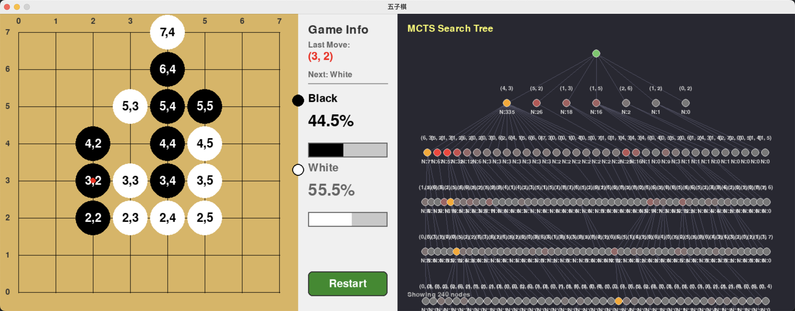

# AlphaZero Gomoku with MCTS Visualization 🎯

基于 AlphaZero 算法的五子棋 AI，带有 MCTS 搜索树实时可视化功能。

## 🎮 项目演示

### 对弈界面截图


### 对弈过程视频

https://github.com/user-attachments/assets/892c5e3a-8b4d-4f8e-9c2a-1b9d3e4f5a6c

> **视频说明**: 展示了完整的人机对弈过程，包括 MCTS 搜索树的实时可视化、胜率评估、以及最终的胜负判定。

> ⚠️ **注意**: 如果上面的视频链接无法访问，请查看项目中的 `asset/game_demo.mp4` 文件。

## ✨ 核心特性

### 🔍 MCTS 搜索树可视化
- **实时展示**: 搜索树的动态增长过程
- **节点信息**: 显示坐标、访问次数(N)、UCT 值
- **高亮显示**: 访问次数最多的节点标记为橙色
- **坐标格式**: 支持 1D/2D 坐标显示切换

### 🎯 胜率评估系统
- **神经网络评估**: 实时计算双方胜率
- **可视化条**: 直观的胜率进度条显示

### ⚡ 性能优化
- **Playout 可视化**: 可选的 MCTS 推演过程可视化
- **日志控制**: `IS_VERBOSE` 全局变量控制详细输出
- **训练集成**: 训练过程中实时展示搜索过程

## 🚀 快速开始

### 环境要求
```bash
Python 3.7+
Pygame 2.0+
PyTorch 1.8+
NumPy 1.19+
```

### 安装依赖
```bash
pip install pygame torch numpy
```

### 运行游戏

#### 人机对战
```bash
python human_play.py
```

#### 开始训练
```bash
python train.py
```

## 🎛️ 配置选项

### 可视化配置
```python
# human_play.py 中的配置
VISUALIZE_PLAYOUT = True   # 启用 playout 可视化
PLAYOUT_DELAY = 0.5        # 每次推演延迟时间
IS_VERBOSE = False         # 详细日志输出控制
```

### 训练配置
```python
# train.py 中的配置
VISUALIZE_PLAYOUT = False  # 训练时禁用可视化以提升性能
PLAYOUT_DELAY = 0.5        # 推演延迟时间
IS_VERBOSE = False         # 详细日志输出控制
```

## 📁 项目结构

```
AlphaZero_Gomoku_Pygame/
├── game.py                 # 核心游戏逻辑与 MCTS 实现
├── human_play.py          # 人机对战入口
├── train.py               # 训练流程
├── policy_value_net_pytorch.py  # PyTorch 神经网络模型
├── ui.py                  # 用户界面组件
├── asset/
│   ├── game_interface.jpg # 对弈界面截图
│   └── game_demo.mp4      # 对弈过程演示视频
├── README.md              # 项目文档
└── note.txt               # 开发笔记
```

## 🎮 操作说明

### 游戏界面
- **左侧**: 8×8 五子棋棋盘
- **中间**: 游戏信息和胜率显示
- **右侧**: MCTS 搜索树可视化

### 控制方式
- **鼠标点击**: 在棋盘上落子
- **重开按钮**: 点击重新开始当前对局
- **ESC**: 退出游戏

### 可视化时序
1. **t1**: MCTS 搜索推演过程
2. **t2**: 展示搜索树和最优候选
3. **t3**: 棋盘落子并刷新界面

## 🔧 技术架构

### MCTS 算法
- **选择(Selection)**: 基于 UCT 公式选择最优子节点
- **扩展(Expansion)**: 扩展新的叶子节点
- **评估(Evaluation)**: 神经网络评估局面价值
- **回溯(Backpropagation)**: 更新路径上所有节点的统计信息

### AlphaZero 集成
- **策略网络**: 提供先验概率，指导 MCTS 搜索
- **价值网络**: 评估局面胜率，减少搜索深度
- **自我对弈**: 生成训练数据，持续优化模型

## 📊 性能表现

### 胜率统计
- **训练进度**: 通过 `policy_evaluate` 监控模型性能
- **实时评估**: 每步落子后的胜率变化
- **胜负记录**: 详细的对局统计信息

### 可视化效果
- **搜索树**: 层次化展示 MCTS 决策过程
- **节点信息**: 完整的统计数据显示
- **动态更新**: 实时反映搜索进展

## 🎯 应用场景

1. **AI 研究**: 学习 AlphaZero 算法实现
2. **教学演示**: 可视化展示 MCTS 工作原理
3. **棋类 AI**: 五子棋 AI 对战平台
4. **算法优化**: MCTS 参数调优实验

## 📝 开发笔记

详细的技术实现说明和开发心得请参考 [note.txt](./note.txt) 文件。

## 🚀 未来计划

- [ ] 支持更多棋类游戏
- [ ] 优化神经网络架构
- [ ] 添加网络对战功能
- [ ] 提升可视化效果
- [ ] 支持更大棋盘尺寸

## 📄 许可证

本项目采用 MIT 许可证，详见 [LICENSE](LICENSE) 文件。

## 🙏 致谢

感谢 AlphaZero 论文作者和开源社区提供的宝贵资源！

---

**🌟 如果这个项目对您有帮助，请给个 Star 支持一下！**

